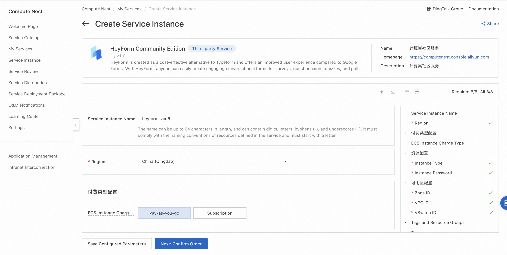
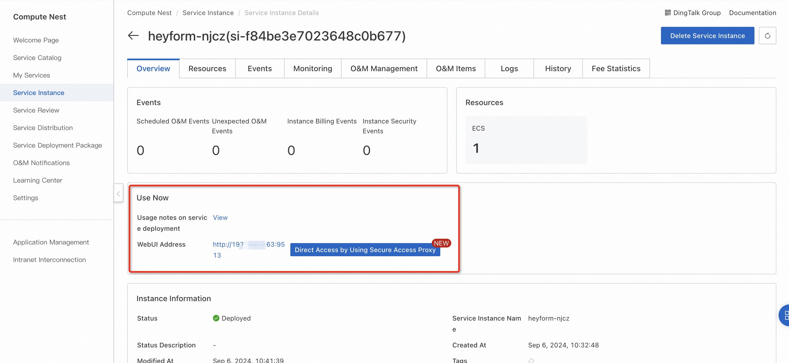
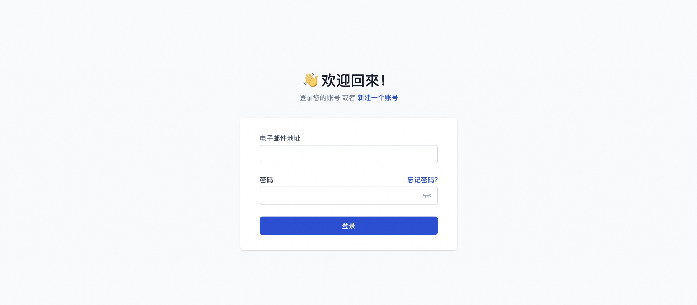

<h1>HeyForm Community Edition Rapid Deployment </h1>

<h2> Overview </h2>

HeyForm was created as a cost-effective alternative to Typeform, and it provides a better user experience compared to Google Forms. With HeyForm, anyone can easily create engaging conversation forms for surveys, questionnaires, quizzes, and polls without any coding skills. For more information, see the <a href = "https://docs.heyform.net/introduction">HeyForm website </a>. 

<h2> Billing instructions </h2>

 The costs on the HeyForm Community Edition are mainly related to:

<ul>
<li> Selected vCPU and Memory Specifications </li>
<li> System disk type and capacity </li>
<li> Internet bandwidth </li>
</ul>

<h2> Permissions required for RAM accounts </h2>

 To deploy the HeyForm Community Edition, you need to access and create some Alibaba Cloud resources. Therefore, your account must contain permissions for the following resources.
<strong> Note </strong>: This permission is required only when your account is a RAM account. 

<table>
<thead>
<tr>
<th> Permission policy name </th>
<th> Remarks </th>
</tr>
</thead>
<tbody>
<tr>
<td>AliyunECSFullAccess</td>
<td> Permissions to manage ECS </td>
</tr>
<tr>
<td>AliyunVPCFullAccess</td>
<td> Permissions for managing VPC networks </td>
</tr>
<tr>
<td>AliyunROSFullAccess</td>
<td> Manage permissions for Resource Orchestration Services (ROS) </td>
</tr>
<tr>
<td>AliyunComputeNestUserFullAccess</td>
<td> Manage user-side permissions for the compute nest service (ComputeNest) </td>
</tr>
</tbody>
</table>

<h2> Deployment process </h2>

<ol>
<li>
 Visit the HeyForm community service <a href = "https://computenest.console.aliyun.com/service/instance/create/cn-hangzhou?type=user&ServiceId=service-a47e56f0ea9f460d8d33"> Deployment link </a> and fill in the deployment parameters as prompted:

</li>
<li>
 after the parameters are filled in, you can see the corresponding inquiry details. after confirming the parameters, click <strong> next: confirm the order </strong>. Confirm that the order is complete and agree to the service agreement and click <strong> Create Now </strong> to proceed to the deployment phase. 
</li>
<li>
 After the deployment is completed, enter the service instance management and find the HeyForm service access link in the console.

</li>
<li>
 Click the link to access the service.

</li>
</ol>
